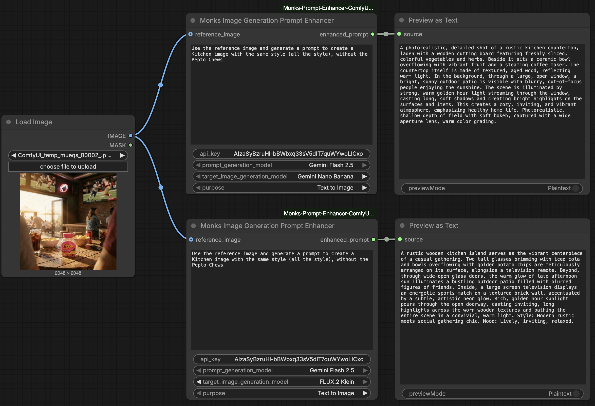

# Monks Image Generation Prompt Enhancer

A ComfyUI custom node that uses the Gemini API to rewrite a raw prompt into one optimised for a specific image generation model and workflow.

The node selects the right prompting strategy based on two inputs: the **target image generation model** and the **purpose**. Each combination loads a dedicated system prompt, so the output always matches the expectations of the downstream model.

## Features

- Per-model, per-purpose system prompts — no one-size-fits-all rewrites
- Supports Gemini Nano Banana and FLUX.2 Klein out of the box
- Three workflow modes: text-to-image, image editing, multi-image fusion
- Masked API key input
- Raises errors on failure — no silent fallbacks

## Installation

1. Copy the `monks_prompt_enhancer/` folder into your `ComfyUI/custom_nodes/` directory.
2. Install the dependency:
   ```bash
   pip install google-generativeai
   ```
3. Restart ComfyUI.

The node will appear under the **Gemini AI/TextGen** category.

## Inputs

| Input | Type | Description |
|---|---|---|
| `prompt` | Text (multiline) | The raw prompt to enhance |
| `api_key` | Text (masked) | Your Google Gemini API key |
| `prompt_generation_model` | Dropdown | Gemini model used to enhance the prompt |
| `target_image_generation_model` | Dropdown | Image generation model the enhanced prompt is intended for |
| `purpose` | Dropdown | Workflow mode |
| `reference_image` | IMAGE (optional) | Reference image passed to Gemini alongside the prompt |

## Outputs

| Output | Type | Description |
|---|---|---|
| `enhanced_prompt` | STRING | The enhanced prompt returned by Gemini |

## Target Image Generation Models

### Gemini Nano Banana
Prompts are written as rich narrative prose structured around subject, setting, details, lighting, atmosphere, and style — optimised for Gemini's native image generation pipeline.

### FLUX.2 Klein
FLUX.2 [klein] does not apply prompt upsampling: what you write is exactly what you get. The prompting strategy therefore varies by purpose:

- **Text to Image** — flowing, highly descriptive prose (no keyword lists). Leads with the main subject, front-loads the most important elements, and ends with an explicit style and mood statement. Lighting description is treated as the single highest-impact element.
- **Image Editing** — concise, action-oriented directives that describe only the transformation. Base-image descriptions are stripped out entirely; the pixel data carries the visual context.
- **Multi Image Fusion** — minimal explicit reference prompts (e.g. `"Change image 1 to match the style of image 2"`). Over-prompting confuses the model's cross-attention mechanisms, so prompts are kept as simple as possible.

## Purposes

### Text to Image
Expands a raw idea into a detailed, model-ready prompt for generating a new image from scratch.

### Image Editing
Refines a description of what should change in an input image. Returns only the transformational action — not a description of what the image already looks like.

### Multi Image Fusion
Produces a prompt that defines how multiple input images should interact or transfer properties to each other.

## System Prompts

System prompts are organised by target image generation model under `prompts/`:

```
prompts/
├── nano_banana/
│   ├── text_to_image.md
│   ├── image_editing.md
│   └── multi_image_fusion.md
└── flux_klein/
    ├── text_to_image.md
    ├── image_editing.md
    └── multi_image_fusion.md
```

Edit the relevant file to customise the enhancement behaviour for a specific model/purpose combination without touching the node code. To add a new target model, create a new subfolder with the three purpose files and register it in `IMAGE_GENERATION_MODELS` in `monks_prompt_enhancer.py`.

## Prompt Generation Models

| `prompt_generation_model` | Model ID |
|---|---|
| Gemini Flash 2.5 | `gemini-2.5-flash` |

## Usage Examples

### Text to Image — no reference image
Write a short description and let the node expand it into a detailed, structured prompt ready for image generation.


> **Input:** `Generate a wide open shot of a forest`
> **Output:** A photorealistic wide-angle shot of a majestic, ancient forest, showcasing towering pine and oak trees reaching towards the sky. The forest floor is covered in rich green moss and ferns, with shafts of soft, dappled golden hour sunlight filtering down through the dense canopy, creating a serene and ethereal atmosphere. Captured with a wide-angle lens, emphasizing the expansive scale and natural beauty of the untouched wilderness, with a shallow depth of field.

---

### Text to Image — with Reference Image
Connect an image to give Gemini a visual reference. The node generates a new prompt inspired by the image's composition, style, or content.


> **Input:** `Use the reference image and generate a prompt to create that image`
> **Output:** A high-resolution, studio-lit product photograph of a pink Pepto Bismol bottle with a yellow cap, standing prominently at the center of a clean, light-colored marble dining table. In the softly blurred background, a woman and a man are seated at the table, engaged in a warm, natural conversation. The entire scene is brightly illuminated by bright, natural daylight streaming through a large window, creating soft reflections on the marble surface and adding warmth and authenticity to the lifestyle setting of the product. Camera angle is a straight-on medium shot, with a shallow depth of field keeping the product in sharp focus while gently blurring the background. Ultra-realistic, sharp focus on the product, vertical portrait format.

---

### Image Editing — with Reference Image
Connect the image to edit and describe the change. The node strips out any description of the base image and returns only the transformational action.


> **Input:** `Remove the Bottle from the Table`
> **Output:** Remove the pink Pepto Bismol bottle from the table. Fill the space with the existing marble tabletop texture, maintaining the original lighting and reflections.

---

### Model Variance — same prompt, different target models
Switching `target_image_generation_model` on the same input produces structurally different outputs. Gemini Nano Banana receives a rich narrative paragraph; FLUX.2 Klein receives prose or a concise directive tuned to how that model processes text — no keyword lists, no redundant descriptions.


