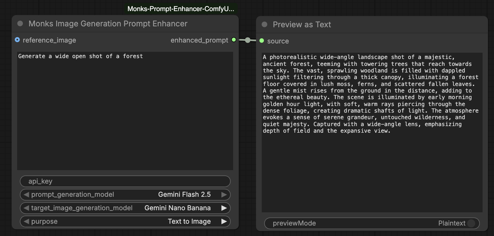
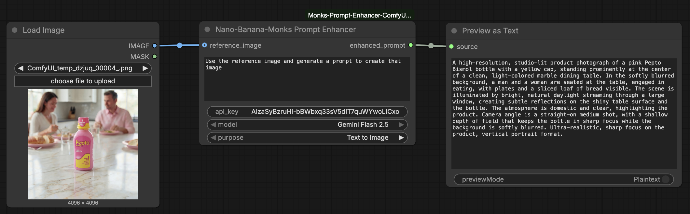
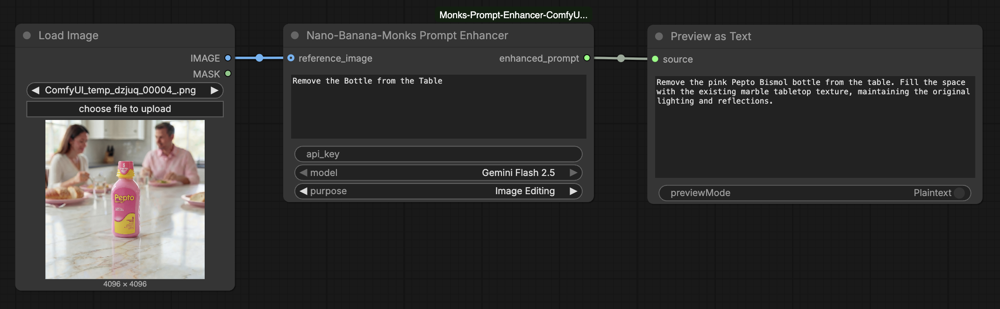

# Nano-Banana-Monks Prompt Enhancer

A ComfyUI custom node that enhances image generation prompts using the Gemini API.

## Features

- Enhances raw prompts into detailed, model-optimized descriptions
- Three purpose-specific system prompts tuned for different workflows
- Masked API key input
- Raises errors on failure — no silent fallbacks

## Installation

1. Copy the `monks_prompt_enhancer/` folder into your `ComfyUI/custom_nodes/` directory.
2. Install the dependency:
   ```bash
   pip install google-generativeai
   ```
3. Restart ComfyUI.

The node will appear under the **Gemini AI/TextGen** category.

## Inputs

| Input | Type | Description |
|---|---|---|
| `prompt` | Text (multiline) | The raw prompt to enhance |
| `api_key` | Text (masked) | Your Google Gemini API key |
| `prompt_generation_model` | Dropdown | Gemini model used to enhance the prompt |
| `target_image_generation_model` | Dropdown | Image generation model the enhanced prompt is intended for |
| `purpose` | Dropdown | Prompt enhancement mode |
| `reference_image` | IMAGE (optional) | Reference image passed to Gemini alongside the prompt |

## Outputs

| Output | Type | Description |
|---|---|---|
| `enhanced_prompt` | STRING | The enhanced prompt returned by Gemini |

## Purposes

### Text to Image
Rewrites the prompt as a flowing, narrative paragraph structured around subject, setting, details, lighting, atmosphere, and style — optimized for Gemini's native text-to-image generation. If a reference image is connected, Gemini uses it as a style or composition reference.

### Image Editing
Refines the prompt to clearly describe **what should change** in a reference image, using precise editing patterns (additions, removals, style transfers, multi-image compositions). Connect the image being edited as the reference image.

### Multi Image Fusion
Structures the prompt for inpainting: clearly names the target region to change and explicitly preserves everything else, using Gemini's semantic masking capabilities. Connect the base image as the reference image.

## Usage Examples

### Text to Image — no reference image
Write a short description and let the node expand it into a detailed, structured prompt ready for image generation.



> **Input:** `Generate a wide open shot of a forest`
> **Output:** A photorealistic wide-angle shot of a majestic, ancient forest, showcasing towering pine and oak trees reaching towards the sky. The forest floor is covered in rich green moss and ferns, with shafts of soft, dappled golden hour sunlight filtering down through the dense canopy, creating a serene and ethereal atmosphere. Captured with a wide-angle lens, emphasizing the expansive scale and natural beauty of the untouched wilderness, with a shallow depth of field.

---

### Text to Image — with Reference Image
Connect an image to give Gemini a visual reference. The node generates a new prompt inspired by the image's composition, style, or content.



> **Input:** `Use the reference image and generate a prompt to create that image`
> **Output:** A high-resolution, studio-lit product photograph of a pink Pepto Bismol bottle with a yellow cap, standing prominently at the center of a clean, light-colored marble dining table. In the softly blurred background, a woman and a man are seated at the table, engaged in a warm, natural conversation. The entire scene is brightly illuminated by bright, natural daylight streaming through a large window, creating soft reflections on the marble surface and adding warmth and authenticity to the lifestyle setting of the product. Camera angle is a straight-on medium shot, with a shallow depth of field keeping the product in sharp focus while gently blurring the background. Ultra-realistic, sharp focus on the product, vertical portrait format.

---

### Image Editing — with Reference Image
Connect the image to edit and describe the change. The node refines the prompt for precision so Gemini knows exactly what to modify and what to preserve.



> **Input:** `Remove the Bottle from the Table`
> **Output:** Remove the pink Pepto Bismol bottle from the table. Fill the space with the existing marble tabletop texture, maintaining the original lighting and reflections.

---

## System Prompts

System prompts are organised by target image generation model under `prompts/`:

```
prompts/
├── nano_banana/
│   ├── text_to_image.md
│   ├── image_editing.md
│   └── multi_image_fusion.md
└── flux_klein/
    ├── text_to_image.md
    ├── image_editing.md
    └── multi_image_fusion.md
```

Edit the relevant file to customize the enhancement behavior for a specific model/purpose combination without touching the node code. To add a new target model, create a new subfolder with the three purpose files and register it in `IMAGE_GENERATION_MODELS` in `monks_prompt_enhancer.py`.

## Prompt Generation Models

| `prompt_generation_model` | Model ID |
|---|---|
| Gemini Flash 2.5 | `gemini-2.5-flash` |

## Target Image Generation Models

| `target_image_generation_model` | Prompts subfolder |
|---|---|
| Gemini Nano Banana | `prompts/nano_banana/` |
| FLUX.2 Klein | `prompts/flux_klein/` |
